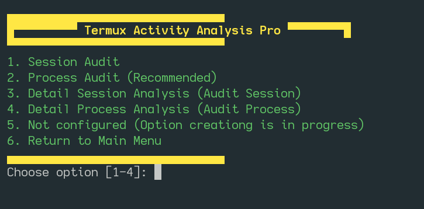

---

🚀 Termux Session Manager Pro

Version 4.0 – Process Tracking | Smart Recovery | Advanced Analytics

<p align="center">
  
  <br>
  <em>Take full control of your Termux environment with intelligent session management. Many of my work online soon</em>
</p>

---

📖 Table of Contents
1. Features
2. How It Works
3. Directory Structure
4. Requirements
5. Installation
6. Usage
7. Menu Options Explained
8. Logging & Analytics
9. Compatibility with Other Linux Flavors
10. Future Scope & Development
11. Screenshots & GIFs
12. GitHub Pages – Web Preview
13. License

---

✨ Features

Feature Description:
1. Smart Session Restart Three restart modes (soft, activity, full reset) without losing context.
2. Automated Process Recovery Detects crashed services (SSH, Python, Node, etc ) and restarts them intelligently.
3. Real‑time Process Dashboard Live watch‑based process viewer sorted by memory usage.
4. Resource Monitor Instant access to htop / top.
5. Emergency Stop Kill all child processes of the current session with one command.
6. Comprehensive Logging Two dedicated log files for session events and process snapshots.
7. Cold Start Detection Logs when Termux is freshly launched.
8. System Stats Capture Memory & CPU usage appended to session log.
9. Activity Logs Sub‑Menu Quick view or deep inspection of audit trails.
10. Color‑coded Terminal UI Clear, intuitive menu with professional design.
11. Modular & Extensible Bash script with clean functions – easy to customise.

---

⚙️ How It Works

1. Initialisation
   · Creates ~/logs/termux-refresher-maintaince/ and sets secure permissions.
   · Detects if the session is a cold start (no parent process) and logs system stats.
2. Logging Engine
   · Every user action and system event is timestamped and written to session_audit.log.
   · Process snapshots (ps aux) are saved to process_audit.log before restarts.
3. Recovery Engine
   · When AUTO_RECOVER=true, the script scans the last process snapshot.
   · If SSH, Python, or Node were running, it attempts to restart them automatically.
4. Restart Mechanisms
   · Soft Restart: exec $SHELL -l – replaces the current shell, preserves environment.
   · Activity Restart: am broadcast – recreates the Termux Android activity (Termux only).
   · Session Reset: termux-reload-settings – reloads Termux configuration.
5. Monitoring
   · Process Dashboard: watch -n1 ps aux --sort=-%mem – refreshes every second.
   · Resource Monitor: launches htop (fallback top).
6. Emergency Stop
   · pkill -9 -P "$PPID" – terminates all processes owned by the parent shell.

---

📁 Directory Structure

```
$HOME/
├── logs/
│   └── termux-refresher-maintaince/
│       ├── session_audit.log      # Session events, cold starts, system stats
│       └── process_audit.log      # Full process snapshots (ps aux)
└── termux_refresher.sh           # Main script (any location)
```

All log files are created with chmod 600 (read/write for owner only) for security.

---

📦 Requirements

· Termux (Android) – core functionality tested on F‑Droid / Google Play versions.
· Optional but recommended packages (install via pkg):
  · htop – for the resource monitor.
  · procps – provides watch, pkill, free, top.
  · termux-tools – for termux-reload-settings.
· Android API – Activity restart uses am (available on all Android devices).
· Bash 4.0+ – for associative arrays (used in recover_services).

---

🔧 Installation

1. Download the script

```bash
curl -o ~/termux_session_manager.sh \
  https://github.com/VICODE-ME/Termux_Session_Manager/termux_session_manager.sh
```

2. Make it executable

```bash
chmod +x ~/termux_session_manager.sh
```

3. (Optional) Install dependencies

```bash
pkg update && pkg install htop procps termux-tools
```

4. Run it

```bash
./termux_session_manager.sh
```

Pro tip: Add an alias to your .bashrc
alias sessionpro='~/termux_refresher.sh'

---

🎮 Usage

Launch the script – you will be greeted by the main menu:

```
▄▄▄▄▄▄▄▄▄▄▄▄▄▄▄▄▄▄▄▄▄▄▄▄▄▄▄▄▄▄▄
█▀▀▀▀▀▀▀▀▀ Termux Session Manager Pro ▀▀▀▀▀▀▀▀█
▀▀▀▀▀▀▀▀▀▀▀▀▀▀▀▀▀▀▀▀▀▀▀▀▀▀▀▀▀▀▀
1. Soft Restart
2. Activity Restart
3. Session Reset
4. Process Dashboard
5. Resource Monitor
6. Emergency Stop
7. Activity Logs
8. Exit
```

Navigate with number keys. After each action you usually return to the menu.

---

📋 Menu Options Explained

Option Command Effect
1. Soft Restart exec $SHELL -l Replaces current shell – fastest, keeps most state.
2. Activity Restart am broadcast ... Recreates Termux Android window – useful after UI glitches.
3. Session Reset termux-reload-settings Reloads Termux configuration, then tries to recover services.
4. Process Dashboard watch -n1 ps aux ... Live view of top memory‑consuming processes.
5. Resource Monitor htop (or top) Full interactive system monitor.
6. Emergency Stop pkill -9 -P "$PPID" Kills all child processes – use when unresponsive.
7. Activity Logs Sub‑menu View session / process logs (tail or full file).
8. Exit exit 0 Leaves the script.

---

📊 Logging & Analytics

Two log files are maintained:

1. session_audit.log
   · Every menu selection and system event.
   · Cold start detection.
   · Memory & CPU snapshots.
   · Service recovery attempts (success/failure).
2. process_audit.log
   · Full process lists (ps aux) captured before each restart or reset.
   · Useful for forensic analysis or debugging.

View logs quickly via Option 7 → choose 1 or 2 for tail -n 10, or 3/4 for the full file with more.

---

🐧 Compatibility with Other Linux Flavors

While Termux Session Manager Pro is crafted for Termux on Android, 
 many features work on standard Linux distributions (Ubuntu, Debian, Fedora, etc.) with minor adjustments.

Feature Works on Linux? Notes
1. Soft Restart ✅ Yes exec $SHELL -l works everywhere.
2. Process Dashboard ✅ Yes Requires watch and ps (procps).
3. Resource Monitor ✅ Yes htop or top present.
4. Emergency Stop ✅ Yes pkill works on Linux.
5. Session Reset ❌ No termux-reload-settings is Termux‑only.
6. Activity Restart ❌ No Android am command not available.
7. Service Recovery ⚠️ Partial Works, but you may need to adjust service names.

To use on Linux:

· Comment or remove lines containing am broadcast and termux-reload-settings.
· Ensure watch, pkill, free are installed (usually present by default).

A Linux‑native fork is planned – see Future Scope.

---

🔮 Future Scope & Development

We are actively improving the project. Planned features:

· Configuration file (~/.config/termux-session-pro/config) to set:
  · Auto‑recovery on/off
  · Custom service list
  · Log retention policy
· Better analytics – generate CPU/memory usage graphs from logs.
· Notification support – Termux:API integration for restart alerts.
· Linux native version – script variant without Android‑specific commands.
· Plugin system – easily add custom restart actions.
· Web interface (experimental) – view logs via a local HTTP server.

---

🖼️ Screenshots & GIFs

<p align="center">
  
  <br>
  <em>Main menu – clean, colour‑coded interface.</em>
</p>

<p align="center">
  
  <br>
  <em>Live process dashboard (watch + ps).</em>
</p>

<p align="center">
  
  <br>
  <em>Quick session audit with tail.</em>
</p>

---

🌐 Web Preview (How Script work): https://vicode-me.github.io/web-not-for-user/.
The terminal is interactive, please spend some time over above link to understand the working of Termux Session Manager Pro

---

🤝 Contributing

Contributions are welcome!

· Report bugs – open an issue with the output of your log files.
· Suggest features – use the issue tracker.
· Code – fork, branch, commit, and PR.

Please adhere to the existing coding style and ensure your changes are well‑commented.

---

📄 License

This project is licensed under the MIT License – feel free to use, modify, and distribute it.

---

<p align="center">
  Made with ❤️ and passion for microsystem Development for the Termux community.
</p>

---

